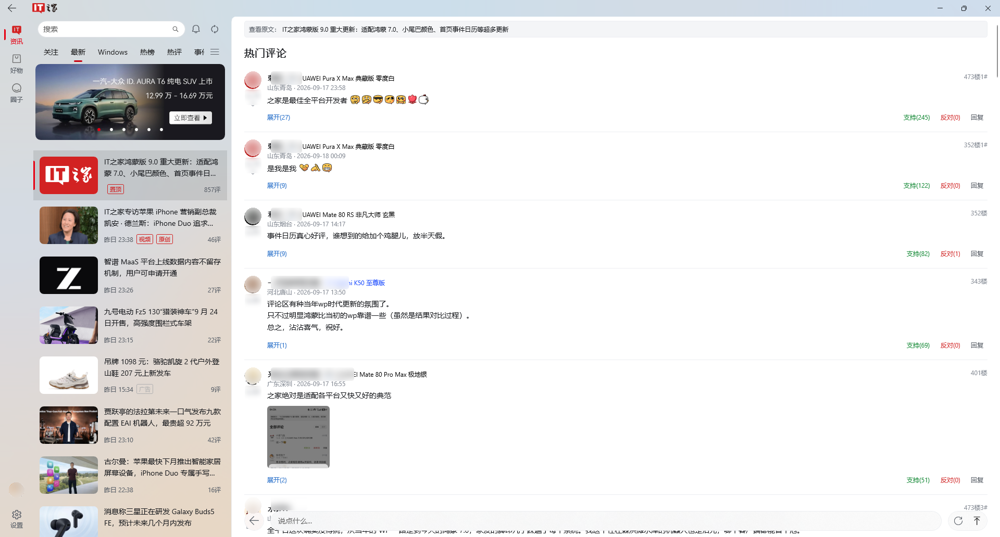
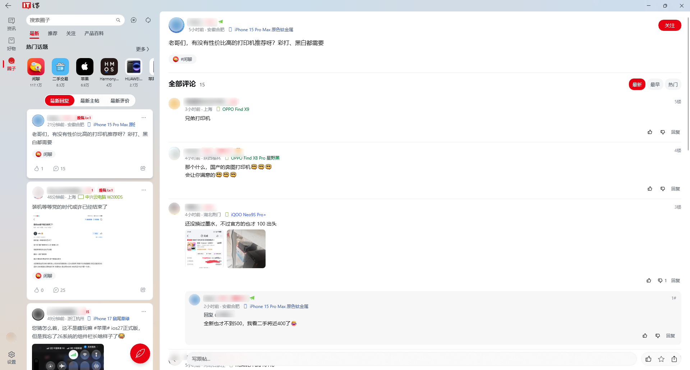
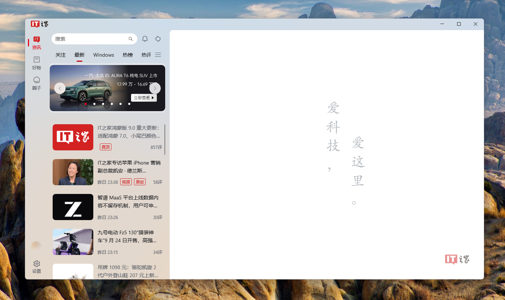

# IT之家 WinUI 3 客户端

基于 **Windows App SDK / WinUI 3** 的第三方「IT之家」Windows 桌面客户端，使用 C# 与 .NET 10 构建。

本仓库是**发布与反馈仓库**：在这里下载安装包、查看更新说明、提交问题与建议。
不包含应用程序源代码（见下方[关于源码](#关于源码)）。

- [下载最新版本](https://github.com/diave971/IThome-For-WinUI/releases/latest)
- [查看全部版本](https://github.com/diave971/IThome-For-WinUI/releases)
- [提交问题或建议](https://github.com/diave971/IThome-For-WinUI/issues/new/choose)

## 界面预览

> 截图取自 Windows x64 构建。示例中涉及的个人信息与第三方用户昵称、头像、地理位置、机型均已遮盖。

### 资讯流与文章阅读

三栏 Wide 布局：左侧频道与信息流，右侧为文章正文（本地 WebView2 外壳渲染，保真排版）。

### 评论

文章评论区支持热门/最新排序、楼中楼展开与支持/反对操作。

### 圈子

帖子流支持「最新回复 / 最新主帖 / 最新评价」三个维度切换，右侧为帖子详情与评论。

### 好物

商品流与热卖榜，支持分类筛选与爆料入口。

### 账号与设置

账号中心汇总评论、帖子、收藏与足迹；设置页提供主题、字体、字号与阅读行为等选项。

### 登录

使用 IT之家账号登录，会话与评论、圈子共用。

### 三态自适应布局

窗口宽度变化时在三种布局间自动切换，同一套页面结构适配不同屏幕。

**Wide（宽屏，三栏）**

**Medium（中屏，两栏）**

**Narrow（窄屏，单栏）**

## 功能特性

| 模块 | 说明 |
| --- | --- |
| 资讯流 | 官方频道列表与分类切换、下拉刷新、滚动加载、置顶条目 |
| 文章详情 | 本地 WebView2 外壳渲染，深浅色双套排版，正文保真 |
| 图片查看 | 视口懒加载 + 缩放查看，支持滚轮缩放、双击切换、上一张/下一张与保存图片 |
| 评论区 | 楼层列表、楼中楼、发表评论与回复 |
| 圈子 | 帖子流、帖子详情、话题与用户主页、发帖管理 |
| 好物 | 商品流、商品详情、爆料入口 |
| 直播 | WebView2 + hls.js 播放 m3u8 直播流 |
| 搜索 | 资讯、圈子、好物三个维度统一搜索入口 |
| 账号 | 登录、账号中心、评论/圈子会话共享 |
| 本地数据 | 足迹与收藏本地留存，无数据库依赖 |
| 外观 | 浅色 / 深色主题，Mica / Acrylic 窗口背景材质 |

另有设置项：缓存清理、性能诊断日志开关、关于页等。

## 下载与平台支持

普通用户请优先从[最新版本](https://github.com/diave971/IThome-For-WinUI/releases/latest)下载，
每个 Release 的说明会列出实际附件、签名状态与安装限制。

| 平台 | 支持架构 | 产物 | 安装方式 |
| --- | --- | --- | --- |
| Windows 10 1809 (17763) 及以上 | x64、ARM64 | `-portable.zip` | 解压后直接运行 `ITHomeWinUI.exe` |
| Windows 10 1809 (17763) 及以上 | x64、ARM64 | `.msix` | 需先信任随附证书，再双击安装 |

每个 Release 同时提供 `SHA256SUMS.txt`，用于校验下载文件完整性。

### 绿色版（推荐）

1. 下载 `ITHomeWinUI-<版本>-windows-<架构>-portable.zip`
2. 解压到任意目录（**请勿在压缩包内直接运行**）
3. 双击 `ITHomeWinUI.exe`

产物为自包含发布，已内置 .NET 与 Windows App SDK 运行时，**无需另行安装任何依赖**。
卸载即删除目录。

若首次运行出现 Windows SmartScreen 提示，选择「更多信息」→「仍要运行」。
应用未做商业代码签名，这是未签名应用的预期提示。

### MSIX 安装版

MSIX 需要证书信任才能侧载安装：

1. 下载 `.msix` 与 `ITHomeWinUI-signing.cer`（证书随 Release 提供）
2. 双击 `.cer` → 「安装证书」→ 存储位置选**本地计算机** → 放入**受信任的根证书颁发机构**
3. 双击 `.msix` 完成安装

> 只有在已信任证书后才可安装。若跳过第 2 步，安装会以证书链错误失败。

## 关于源码

本仓库**不包含源代码**，也不接受代码贡献。核心源码在私有仓库中维护，
本仓库的 GitHub Actions 工作流会在发布时从私有仓库**只读检出**源码进行构建，
构建产物（安装包）直接附加到 Release。

这样可以做到：源码不公开，同时收敛反馈入口、对外提供可下载的正式产物。

## 环境要求

| 项 | 要求 |
| --- | --- |
| 操作系统 | Windows 10 版本 1809（内部版本 17763）或更高 |
| 架构 | x64 / ARM64 |
| 运行时 | 无需额外安装（自包含发布） |
| WebView2 | Windows 10/11 通常已内置；若文章页空白，请安装 [WebView2 运行时](https://developer.microsoft.com/microsoft-edge/webview2/) |

## 常见问题

打开文章后内容空白或图片不显示

文章正文与图片依赖 WebView2 运行时。Windows 11 与较新的 Windows 10 已内置；
若为精简版系统，请安装 [WebView2 运行时](https://developer.microsoft.com/microsoft-edge/webview2/) 后重启应用。

SmartScreen 提示「Windows 已保护你的电脑」

应用未使用商业代码签名证书，属于未签名应用。选择「更多信息」→「仍要运行」即可。
可自行核对 Release 中的 `SHA256SUMS.txt` 确认文件未被篡改。

MSIX 安装失败，提示证书或信任问题

需先把随附的 `.cer` 证书装入**本地计算机**的**受信任的根证书颁发机构**存储，再安装 `.msix`。
若仍失败，改用绿色版 zip。

如何彻底卸载

绿色版：直接删除解压目录。
MSIX：在「设置 → 应用」中卸载。
本地数据（足迹、收藏、设置）位于 `%LocalAppData%\ITHomeWinUI`，如需彻底清理请手动删除该目录。

## 反馈

- 程序缺陷、崩溃、显示异常：使用 [Bug 报告](https://github.com/diave971/IThome-For-WinUI/issues/new/choose) 模板
- 功能想法：使用功能建议模板
- 提交前请先搜索既有 issue，避免重复

## 免责声明

本项目为**非官方**第三方客户端，与 IT之家（青岛海尔软件有限公司）无任何关联、
未获其授权或认可。「IT之家」及相关内容的商标与版权归其权利人所有。

应用内展示的所有内容均来自 IT之家公开接口与网页，仅供个人学习与技术研究使用。
请勿用于任何商业用途。使用者需自行承担因使用本软件产生的一切风险与责任。
