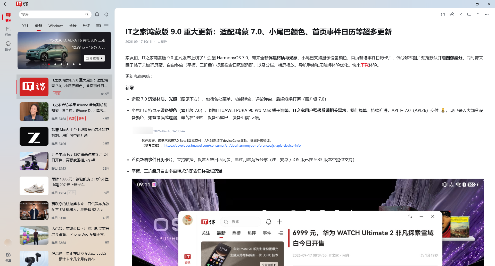
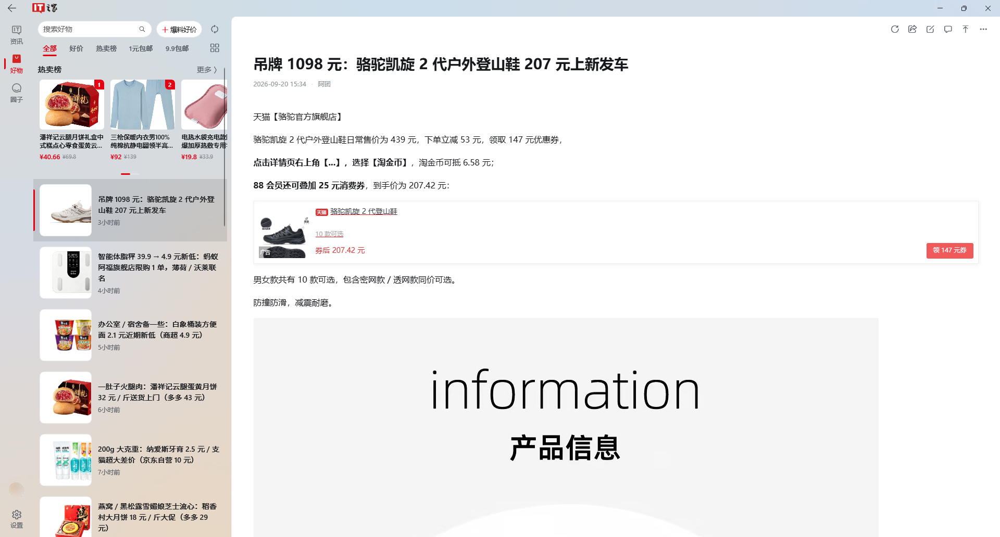
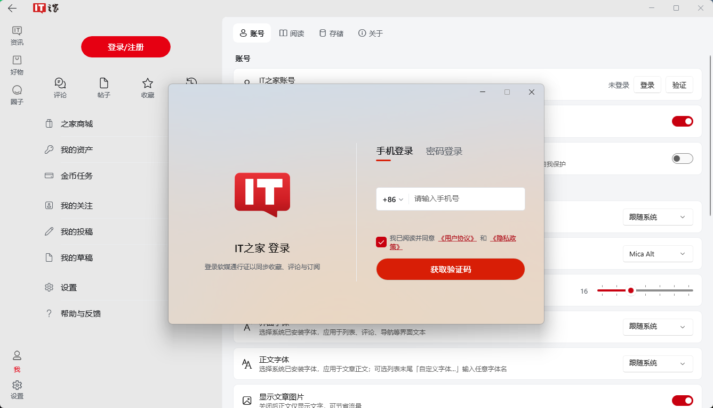
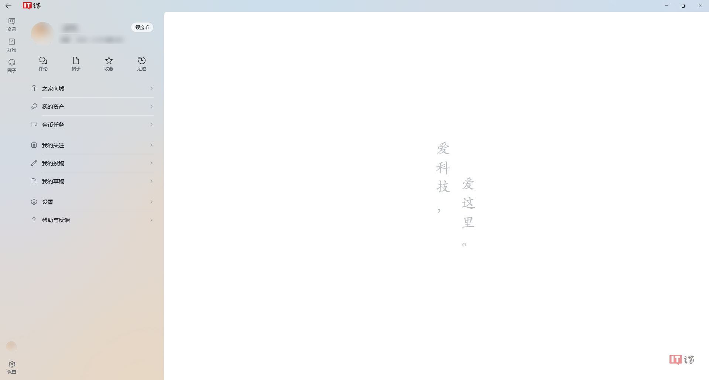
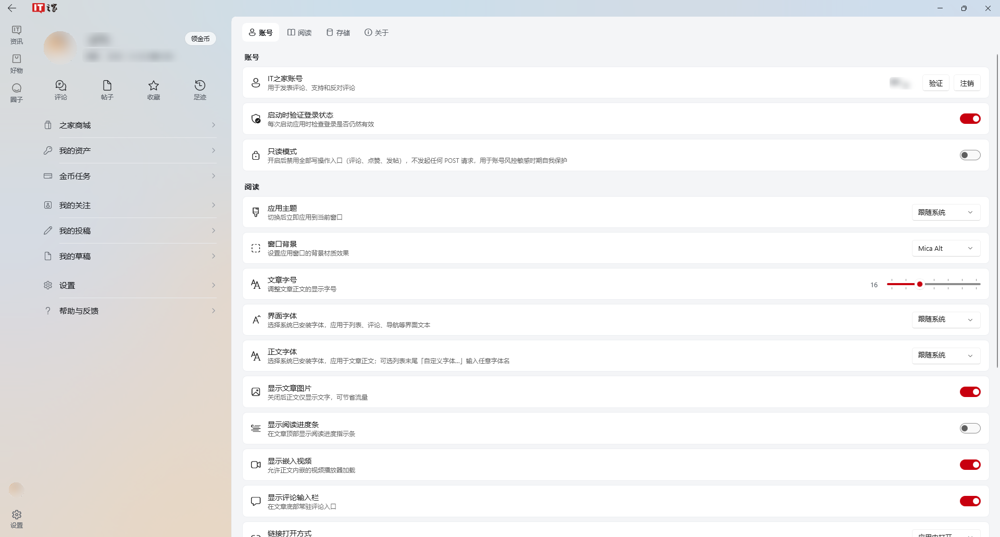
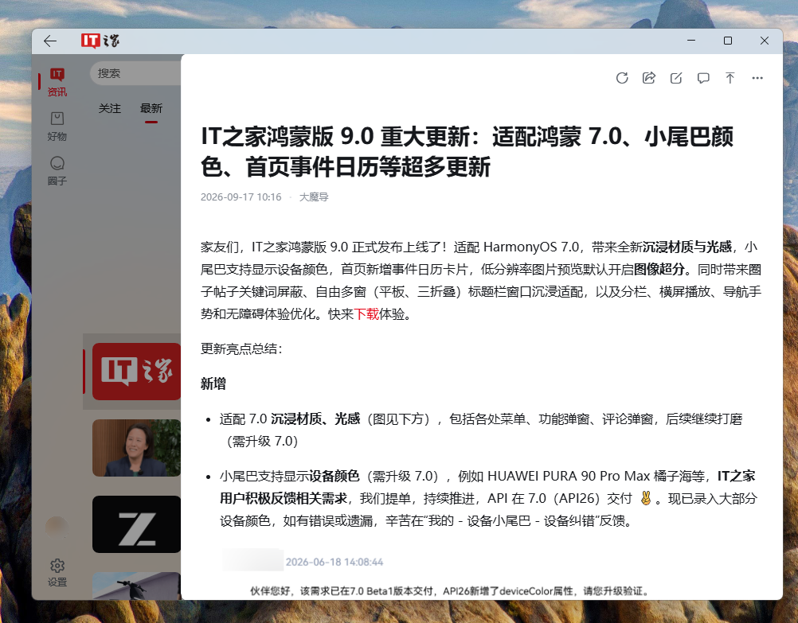
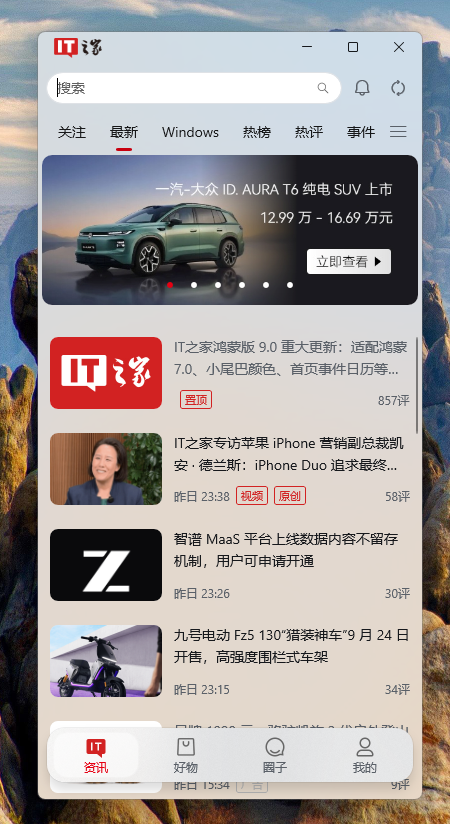

  

# IT之家 WinUI 客户端

基于 WinUI 3 开发的第三方 IT之家 Windows 桌面客户端。

    <a title="下载最新版本" href="https://github.com/diave971/IThome-For-WinUI/releases/latest">下载应用</a>
    ·
    <a title="全部版本" href="https://github.com/diave971/IThome-For-WinUI/releases">全部版本</a>
    ·
    <a title="反馈问题" href="https://github.com/diave971/IThome-For-WinUI/issues/new/choose">反馈问题</a>

---

## 为什么做这个项目

官方的 Windows UWP 客户端长久未维护，在较新的系统下存在多处 Bug 与异常，使用体验不佳。

因为自己平时每天都有在电脑上看资讯刷评论的习惯，所以用 WinUI 3 重新开发了这个客户端。界面采用贴合 Windows 11 的现代流畅设计风格，支持大屏自适应三栏布局，并针对桌面端优化了图文排版与交互细节，带来更轻快、舒适的阅读体验。

## 资讯阅读

首页聚合官方各频道资讯，支持切换频道、一键快速刷新与无限滚动加载。文章正文使用本地 WebView2 渲染，深色模式单独调过样式，代码块和图文排版尽量贴近原网页。

正文里的图片可点击放大，支持滚轮缩放、双击切换与保存到本地，长文滚动时缩略图按视口懒加载。

## 评论区

文章与圈子帖子均支持热门 / 最新排序、楼中楼展开，以及点赞与回复。

## 圈子

帖子流支持「最新回复 / 最新主帖 / 最新评价」三个维度切换，右侧为帖子详情与评论。支持热门话题、话题详情、用户主页与发帖管理。

## 好物

商品流与热卖榜，支持分类筛选与爆料入口，商品详情保留原始促销信息与到手价说明。

## 登录与账号

使用 IT之家账号登录，会话与评论、圈子打通。账号中心汇总评论、帖子、收藏与足迹。

> [!NOTE]
> 登录凭据以 Windows 凭据库（PasswordVault）保存，不上传第三方服务器。足迹、收藏与设置以 JSON 存放在 `%LocalAppData%\ITHomeWinUI\`，应用未使用数据库。

## 外观与设置

支持浅色 / 深色主题，窗口背景支持 Mica 与 Acrylic 材质。设置页可自由调整字号、字体、图片显示开关与阅读偏好。

## 三态自适应布局

窗口拉大拉小会自动调整布局，适配不同的屏幕尺寸与使用习惯：

**Wide（宽屏，三栏）**：左侧频道导航、中间资讯瀑布流、右侧常驻正文与评论，适合大屏沉浸阅读。

| Medium（中屏，两栏） | Narrow（窄屏，单栏） |
| :---: | :---: |
| 频道流 + 独立详情页，适合笔记本与常规视窗 | 单栏精简视图，适合分屏、竖屏或小窗口随航 |
|  |  |

## 下载与安装

> [!IMPORTANT]
> 应用**未做商业代码签名**，首次运行可能出现 SmartScreen 提示，选择「更多信息」→「仍要运行」即可。

每个 Release 同时提供 `SHA256SUMS.txt` 用于校验完整性。

| 安装方式 | 文件 | 说明 |
| --- | --- | --- |
| 绿色版（推荐） | `*-portable.zip` | 解压后直接运行 `ITHomeWinUI.exe`，**无需安装任何依赖** |
| MSIX 安装版 | `*.msix` | 需先信任随附证书，再双击安装 |

### 绿色版

1. 下载 `ITHomeWinUI-<版本>-windows-<架构>-portable.zip`
2. 解压到任意目录（**请勿在压缩包内直接运行**）
3. 双击 `ITHomeWinUI.exe`

产物为自包含发布，已内置 .NET 与 Windows App SDK 运行时，卸载即删除目录。

### MSIX 安装版

1. 下载对应架构的 `.msix` 与 `ITHomeWinUI-signing.cer`
2. 双击 `.cer` → 点击「安装证书」→ 存储位置选 **本地计算机** → 点击下一步
3. 选中 **「将所有证书都放入下列存储」** → 点击「浏览」→ 选择 **「受信任的根证书颁发机构」** → 完成导入
4. 双击 `.msix` 完成安装

> [!WARNING]
> 必须手动将证书指定放入「受信任的根证书颁发机构」，若保留向导默认设置将导致安装因证书链错误（0x800B0109）而失败。若不便修改系统信任设置，推荐直接使用**绿色版**。

## 环境要求

| 项 | 要求 |
| --- | --- |
| 操作系统 | Windows 10 版本 1809（内部版本 17763）或更高 |
| 架构 | x64 / ARM64 |
| 运行时 | 无需额外安装（自包含发布） |
| WebView2 | Windows 10/11 通常已内置；若文章页空白请[安装 WebView2 运行时](https://developer.microsoft.com/microsoft-edge/webview2/) |

## 常见问题

文章打开后内容空白，或图片不显示

文章正文依赖 WebView2 运行时。Windows 11 与较新的 Windows 10 已内置；精简版系统请安装 [WebView2 运行时](https://developer.microsoft.com/microsoft-edge/webview2/) 后重启应用。

怎么彻底卸载、我的数据在哪

绿色版直接删除解压目录；MSIX 在「设置 → 应用」中卸载。
本地数据（足迹、收藏、设置与缓存）位于 `%LocalAppData%\ITHomeWinUI\`，如需彻底清理请手动删除该目录；若曾登录账号，凭据保存在系统的 Windows 凭据管理器中，可在应用内点击注销或在系统凭据管理器中清除。

为什么应用没有代码签名

本项目为个人维护的第三方客户端，未购买商业代码签名证书。安装包由 CI 使用自签证书签名，可自行核对 Release 中的 `SHA256SUMS.txt` 确认文件未被篡改。

## 关于源码

本项目为非官方第三方客户端，暂未获得 IT之家的正式授权。为防范合规风险并避免相关通信接口被恶意滥用，项目源代码暂不公开发布，本仓库仅用于分发构建产物与跟踪用户 Issue 反馈。感谢理解与支持。

## 反馈

- **程序缺陷、崩溃、显示异常**：[Bug 报告](https://github.com/diave971/IThome-For-WinUI/issues/new/choose)
- **功能想法与改进建议**：[功能建议](https://github.com/diave971/IThome-For-WinUI/issues/new/choose)
- **安全漏洞**：请走 [私密报告通道](https://github.com/diave971/IThome-For-WinUI/security/advisories/new)，勿公开提交（见 [SECURITY.md](SECURITY.md)）

提交前请先搜索既有 issue，避免重复；附上版本号与复现步骤会显著加快定位。

## 声明与致谢

1. **主体与版权**：本项目为非官方第三方客户端，与 IT之家（青岛软媒网络科技有限公司）无任何关联。「IT之家」商标、徽标及全部资讯内容的知识产权均归青岛软媒或原作者所有。
2. **定位与非商用**：本项目所有网络通信均基于公开网络协议进行，仅作为面向 Windows 桌面的本地数据显示与排版工具；构建产物供个人免费学习与日常阅读，请勿用于任何商业营利。
3. **权利人通道**：若相关权利人认为本项目涉及侵权，请通过反馈渠道联系，维护者核实后将第一时间积极配合修改或下线相应功能。
4. **开源致谢**：本项目基于 Windows App SDK、CommunityToolkit、FluentIcons、HtmlAgilityPack 等开源项目构建，感谢开源社区的无私贡献。
